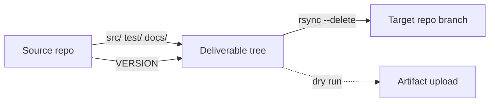

# OP Delivery Workflow

Reusable GitHub Actions workflow that delivers source code to a target Git repository via SSH.

## How It Works



```
Source repo (GitHub)          Deliverable tree (assembled)         Target repo
======================        ============================         ===========

src/  ─────────────────────>  src/                    ───────────> target branch
test/ ─────────────────────>  test/                   ───────────>
docs/ ─────────────────────>  docs/                   ───────────>
VERSION ───(copy)──────────>  src/VERSION             ───────────>
(workflow generates)────────> src/filters/*.properties ──────────>
```

1. **Checkout** the source repo at `github.ref`
2. **Copy** `src/`, `test/`, `docs/` into a staging directory
3. **Place** `VERSION` at `src/VERSION` and generate exclusion `.properties` files
4. **Validate** that all three directories exist
5. **Dry run**: upload as artifact -- **Real run**: rsync to target, commit, push, optionally tag

## Setup

### 1. SSH deploy key

```bash
ssh-keygen -t ed25519 -C "op-delivery-<project>" -f deploy-key -N ""
```

- **Public key** → deploy key (write access) on the target repo
- **Private key** → GitHub Actions secret on the calling repo
- Map it to `SSH_DEPLOY_KEY` in the caller's `secrets:` block

### 2. Create caller workflow

Add `.github/workflows/op-deliver.yml` to your project (see [example](#caller-workflow-example)).

### 3. Test and go live

1. Set `dry_run: true`, push, inspect the uploaded artifact
2. Point at a throwaway test repo, set `dry_run: false`, verify the push
3. Switch to the real target URL and deploy key

## Inputs

| Input | Required | Default | Description |
|-------|----------|---------|-------------|
| `target_repo_url` | No | `''` | SSH URL of the target repo. Not required for dry runs. |
| `target_branch` | No | `develop` | Branch to push to |
| `dry_run` | No | `false` | Upload artifact instead of pushing |
| `commit_message` | No | `''` | Commit body after `delivery: <version>`. Use `\|` as line separator in dispatch UI. |
| `commit_author_name` | **Yes** | -- | Git author name |
| `commit_author_email` | **Yes** | -- | Git author email |
| `create_tag` | No | `false` | Tag the target repo with the VERSION value |
| `fortify_exclude_patterns` | No | `''` | Fortify exclusion patterns (one per line) |
| `odc_exclude_patterns` | No | `''` | ODC exclusion patterns (one per line) |

**Secret:** `SSH_DEPLOY_KEY` -- SSH private key for the target repo. Not needed for dry runs.

Exclusion patterns are joined with commas in the generated `.properties` files:
```
excludePatterns=**/docs/**/*,**/test/**/*
```

## Caller Workflow Example

```yaml
name: Deliver to OP

on:
  workflow_dispatch:
    inputs:
      target_repo_url:
        description: 'SSH URL of the target repository'
        default: 'git@bitbucket.org:your-org/your-repo.git'
        type: string
      target_branch:
        description: 'Branch to push to on the target repository'
        default: 'develop'
        type: string
      dry_run:
        description: 'Validate only — do not push to target'
        default: false
        type: boolean
      create_tag:
        description: 'Tag the delivery on the target repo with the VERSION value'
        default: true
        type: boolean
      commit_message:
        description: 'Commit body (use | as line separator)'
        type: string
      commit_author_name:
        description: 'Git author name for the delivery commit'
        type: string
      commit_author_email:
        description: 'Git author email for the delivery commit'
        type: string

jobs:
  deliver:
    uses: meaningfy-ws/devops-toolkit/.github/workflows/op-delivery.yml@main
    with:
      target_repo_url: ${{ inputs.target_repo_url || 'git@bitbucket.org:your-org/your-repo.git' }}
      target_branch: ${{ inputs.target_branch || 'develop' }}
      dry_run: ${{ inputs.dry_run || false }}
      create_tag: ${{ inputs.create_tag != '' && inputs.create_tag || true }}
      commit_message: ${{ inputs.commit_message || '' }}
      commit_author_name: ${{ inputs.commit_author_name || 'Meaningfy CI' }}
      commit_author_email: ${{ inputs.commit_author_email || 'plumber@meaningfy.ws' }}
      fortify_exclude_patterns: |
        **/docs/**/*
        **/test/**/*
      odc_exclude_patterns: |
        **/docs/**/*
        **/test/**/*
    secrets:
      SSH_DEPLOY_KEY: ${{ secrets.MY_DEPLOY_KEY }}
```

The `||` fallbacks provide defaults when triggered via `push` (testing). `workflow_dispatch` only works on the repo's **default branch**.

## Deliverable Structure

```
docs/
  ...                                  # your documentation
src/
  VERSION                              # copied from repo root
  filters/
    fortify-exclusion.properties       # generated by workflow
    odc-exclusion.properties           # generated by workflow
  your_package/
    ...                                # your source code
test/
  ...                                  # your tests
```

`rsync --delete` removes anything on the target not in the deliverable.

## Developer Responsibilities

The workflow copies files as-is. Before delivery, ensure:

- **VERSION** follows `X.Y.Z-RC.N` format (uppercase RC)
- **No forbidden files** -- OP forbids PDFs, ZIPs, DOCX
- **Lowercase filenames** -- OP requirement
- **`src/`, `test/`, `docs/`** exist with expected content

## Troubleshooting

| Problem | Solution |
|---------|----------|
| "Run workflow" button not visible | Merge the caller workflow to the default branch first |
| SSH permission denied | Verify deploy key has write access and secret contains the private key |
| "No changes to deliver" | Deliverable is identical to target -- normal on re-runs |
