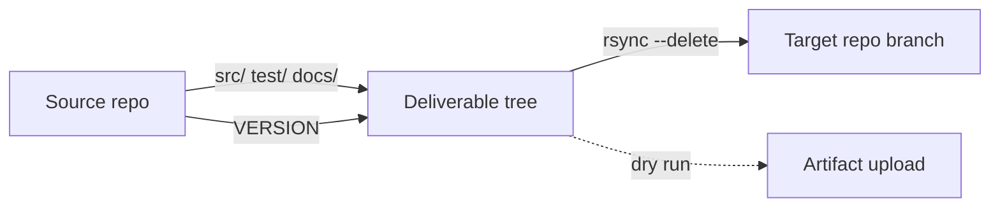

# OP Delivery Workflow

Reusable GitHub Actions workflow that delivers source code to a target Git repository via HTTPS.

## How It Works


```mermaid
flowchart LR
    A[Source repo] -->|src/ test/ docs/| B[Deliverable tree]
    A -->|VERSION| B
    B -->|rsync --delete| C[Target repo branch]
    B -.->|dry run| D[Artifact upload]
```

```
Source repo (GitHub)          Deliverable tree (assembled)         Target repo
======================        ============================         ===========

src/  ─────────────────────>  src/                    ───────────> target branch
test/ ─────────────────────>  test/                   ───────────>
docs/ ─────────────────────>  docs/                   ───────────>
VERSION ───(copy)──────────>  src/VERSION             ───────────>
(workflow generates)────────> src/filters/*.properties ──────────>
```

1. **Checkout** the source repo at `github.ref`
2. **Copy** `src/`, `test/`, `docs/` into a staging directory
3. **Place** `VERSION` at `src/VERSION` and generate exclusion `.properties` files
4. **Validate** that all three directories exist
5. **Dry run**: upload as artifact -- **Real run**: rsync to target, commit, push, optionally tag

## Setup

### 1. HTTPS access token

Create an HTTP access token on the target repository host (e.g., Bitbucket Server → HTTP access tokens) with **write** permission.

- Store the token as a GitHub Actions secret on the calling repo
- Map it to `TARGET_REPO_TOKEN` in the caller's `secrets:` block

### 2. Create caller workflow

Add `.github/workflows/op-deliver.yml` to your project (see [example](#caller-workflow-example)).

### 3. Test and go live

1. Set `dry_run: true`, push, inspect the uploaded artifact
2. Point at a throwaway test repo, set `dry_run: false`, verify the push
3. Switch to the real target URL and token

## Inputs

| Input | Required | Default | Description |
|-------|----------|---------|-------------|
| `target_repo_url` | No | `''` | HTTPS URL of the target repo. Not required for dry runs. |
| `target_branch` | No | `develop` | Branch to push to |
| `dry_run` | No | `false` | Upload artifact instead of pushing |
| `commit_message` | No | `''` | Commit body after `delivery: <version>`. Use `\|` as line separator in dispatch UI. |
| `commit_author_name` | **Yes** | -- | Git author name |
| `commit_author_email` | **Yes** | -- | Git author email |
| `create_tag` | No | `false` | Tag the target repo with the VERSION value |
| `fortify_exclude_patterns` | No | `''` | Fortify exclusion patterns (one per line) |
| `odc_exclude_patterns` | No | `''` | ODC exclusion patterns (one per line) |

**Secret:** `TARGET_REPO_TOKEN` -- HTTPS Bearer token for the target repo. Not needed for dry runs.

Exclusion patterns are joined with commas in the generated `.properties` files:
```
excludePatterns=**/docs/**/*,**/test/**/*
```

## Caller Workflow Example

```yaml
name: Deliver to OP

on:
  workflow_dispatch:
    inputs:
      target_repo_url:
        description: 'HTTPS URL of the target repository'
        default: 'https://bitbucket.example.com/scm/project/repo.git'
        type: string
      target_branch:
        description: 'Branch to push to on the target repository'
        default: 'develop'
        type: string
      dry_run:
        description: 'Validate only — do not push to target'
        default: false
        type: boolean
      create_tag:
        description: 'Tag the delivery on the target repo with the VERSION value'
        default: true
        type: boolean
      commit_message:
        description: 'Commit body (use | as line separator)'
        type: string
      commit_author_name:
        description: 'Git author name for the delivery commit'
        type: string
      commit_author_email:
        description: 'Git author email for the delivery commit'
        type: string

jobs:
  deliver:
    uses: meaningfy-ws/devops-toolkit/.github/workflows/op-delivery.yml@main
    with:
      target_repo_url: ${{ inputs.target_repo_url || 'https://bitbucket.example.com/scm/project/repo.git' }}
      target_branch: ${{ inputs.target_branch || 'develop' }}
      dry_run: ${{ inputs.dry_run || false }}
      create_tag: ${{ inputs.create_tag != '' && inputs.create_tag || true }}
      commit_message: ${{ inputs.commit_message || '' }}
      commit_author_name: ${{ inputs.commit_author_name || 'Meaningfy CI' }}
      commit_author_email: ${{ inputs.commit_author_email || 'plumber@meaningfy.ws' }}
      fortify_exclude_patterns: |
        **/docs/**/*
        **/test/**/*
      odc_exclude_patterns: |
        **/docs/**/*
        **/test/**/*
    secrets:
      TARGET_REPO_TOKEN: ${{ secrets.MY_TARGET_REPO_TOKEN }}
```

The `||` fallbacks provide defaults when triggered via `push` (testing). `workflow_dispatch` only works on the repo's **default branch**.

## Deliverable Structure

```
docs/
  ...                                  # your documentation
src/
  VERSION                              # copied from repo root
  filters/
    fortify-exclusion.properties       # generated by workflow
    odc-exclusion.properties           # generated by workflow
  your_package/
    ...                                # your source code
test/
  ...                                  # your tests
```

`rsync --delete` removes anything on the target not in the deliverable.

## Rehearse a Delivery Locally

Use this procedure when target-repository push access is unavailable but a
local checkout of the matching target branch is available. It applies the
dry-run artifact with the same `rsync` semantics as a real delivery.

1. Run the caller workflow with `dry_run: true`. Select the source release
  branch and set `target_branch` to the matching target release branch.
2. Download the `op-deliverable-<project>-<version>` artifact from the
  successful workflow run. Artifacts are retained for seven days.
3. Update the local target checkout to the matching branch:

  ```bash
  cd /path/to/target-repo
  git switch release/your-release-branch
  git pull --ff-only origin release/your-release-branch
  ```

4. Extract the artifact outside the target checkout, then apply it:

  ```bash
  ARTIFACT_DIR=$(mktemp -d)

  unzip -o ~/Downloads/op-deliverable-<project>-<version>.zip \
    -d "$ARTIFACT_DIR"

  test -d "$ARTIFACT_DIR/src" && \
  test -d "$ARTIFACT_DIR/test" && \
  test -d "$ARTIFACT_DIR/docs"

  rsync -a --delete --exclude '.git' \
    "$ARTIFACT_DIR/" ./

  rm -rf "$ARTIFACT_DIR"
  ```

5. Inspect the local delivery state:

  ```bash
  git status --short
  git diff --stat
  git diff --name-status
  ```

The `rsync --delete` command overwrites delivered files and deletes files at
the target root that are absent from the artifact, while preserving `.git`.
Git shows changes to tracked files; untracked or ignored files removed by the
command cannot be recovered through Git.

## Developer Responsibilities

The workflow copies files as-is. Before delivery, ensure:

- **VERSION** follows `X.Y.Z-RC.N` format (uppercase RC)
- **No forbidden files** -- OP forbids PDFs, ZIPs, DOCX
- **Lowercase filenames** -- OP requirement
- **`src/`, `test/`, `docs/`** exist with expected content

## Troubleshooting

| Problem | Solution |
|---------|----------|
| "Run workflow" button not visible | Merge the caller workflow to the default branch first |
| HTTPS 401/403 | Verify token has write access and the secret is set correctly on the calling repo |
| "No changes to deliver" | Deliverable is identical to target -- normal on re-runs |
